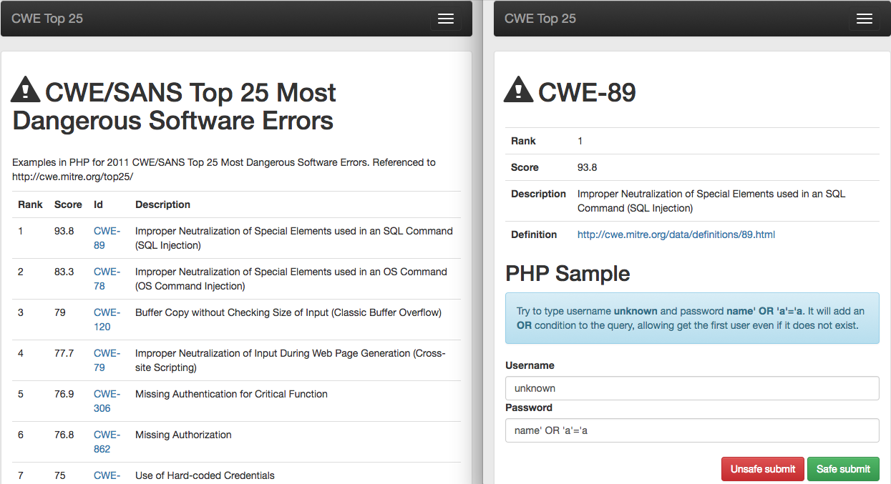

# cwe-top-25
Examples in PHP for 2011 CWE/SANS Top 25 Most Dangerous Software Errors. Referenced to http://cwe.mitre.org/top25/



## How to Install

- Clone the project

```
git clone ...
```

- Install dependencies

```
composer install
```

- Configure database access data in [di/environment.xml]


- Run migrations

```
bin/doctrine migrations:migrate
```

- Use the [cwe-top-25.conf] to your NGinx sites-available configuration.

- Add the following line to your [/etc/hosts]

```
127.0.0.1 cwe-top-25
```

- Access the system front-end

```
http://cwe-top-25/
```
